  

 

## 💫 About Me

- 🎓 **BSc Data Science / Business Analytics** — *Vrije Universiteit Amsterdam*
- 🔧 I sit on the **engineering side of data**: databases, ETL/ELT pipelines, systems that don't fall over
- 🧠 Built a **RAG system on top of a knowledge graph** for my bachelor's thesis *(Netherlands Ministry of Defence)*
- 🌍 Innsbruck, Austria · German (native) · English (C1) · Spanish (B1)
- 🚀 Looking to start my career in a **data engineering** role

 

## 🛠️ Tech Stack

 

|  |  |
|:--|:--|
| **Languages** |    |
| **Data & Pipelines** |      |
| **Cloud & Ops** |    |
| **BI** |   |

 

## 🔬 Projects

### 🕸️ RAG System with Knowledge Graph — *Bachelor's Thesis*

`Netherlands Ministry of Defence · Research Project`

RAG pipeline with an integrated knowledge graph for semantic retrieval over peer-reviewed research papers.

- Embedded **~3,000 documents** with Mistral AI for retrieval and evaluation
- Owned the full pipeline: ingestion → graph structuring → retrieval serving
- Containerised with Docker, shipped via CI/CD, evaluation results landed in **Delta Lake**

### 📉 Model Complexity & Generalisation: Double Descent

`University Project · Machine Learning`

- Studied double descent in ridge regression across **150 model complexities × 20 seeds** — baseline, covariate shift (μ = 1.0), feature correlation (ρ = 0.7)
- Global minimum stays in the overparameterised regime in all three scenarios
- Paired t-test confirms the advantage: **MSE 10.2 vs. 21.9, p < 0.001**

 

## 📜 Certifications

 

## 📊 GitHub Stats

 

  

